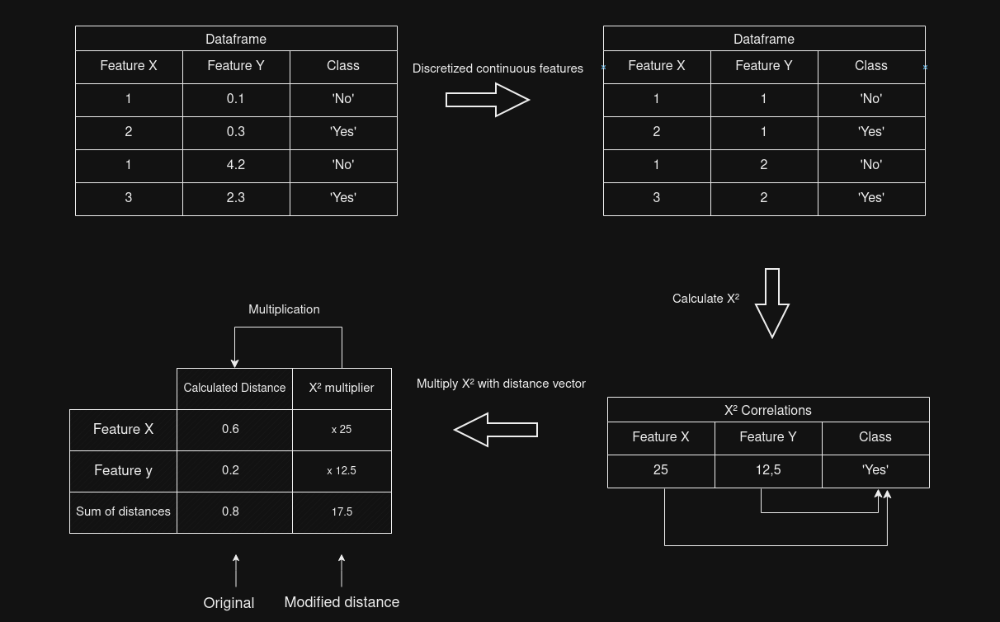

# CC18 - Curated Datasets Analysis
This project analyzes datasets from the OpenML CC18 collection for a Machine Learning course. The goal is to explore various machine learning models, identify datasets that perform poorly with specific models, and attempt to improve performance through modifications.

## Work developed

### 1. Module: exploration
The datasets of CC18 were separated into 3 subgroups based on the target feature: multiclass, balanced binary and imbalanced binary. Different models (decision tree, KNN, and SVM) with varying hyperparameters were applied to each dataset subgroup.
GridSearchCV was used to collect performance metrics (precision, accuracy, recall, and ROC AUC) for each model-dataset combination. 

### 2. Module: analysis
The datasets with the poorest performance within each subgroup were analyzed to identify potential common characteristics. For example, in the balanced binary subgroup, accuracy and ROC AUC were considered appropriate metrics (recall and precision were excluded due to the large number of datasets and the absence of individual analysis). Specific datasets with the lowest accuracy were then examined. This approach was repeated for imbalanced binary datasets using ROC AUC and multiclass datasets using ROC AUC macro. The imbalanced binary datasets were chosen for model modification using the KNN model. 

### 3. Module: modifications
Based on the hypothesis that noisy features might be contributing to the poor performance of the worst-scoring KNN datasets,
the project aims to mitigate this issue. Details of the mitigation approach are presented in the next section. The code for this modification can be found in the modification module.


### 4. Module: evaluation
This section details the testing process for the modifications applied to the imbalanced binary datasets using the KNN model. The goal is to assess whether the modifications improve the model's performance on these datasets.


## KNN Modification
This step explores mitigating poor KNN performance on imbalanced datasets without a data preprocessing step.
We propose a modification to the distance calculation process that considers in apply the feature correlations in it.
 
We created a new implementation for the 
weights hyperparameter called correlations. It modifies the Manhattan distance calculation (from scipy.distance)  by incorporating the feature correlations with the target variable during distance computation. This ensures that even if features with high noise have similar values, they probably won't be considered as a nearest neighbor.




**Correlation Calculation:**

1. Categorical Features: We use Chi-squared (X²) correlations to assess the relationship between categorical features and the target (assumed to be categorical due to dataset curation for classification problems).

2. Continuous Features: We discretize continuous features into bins and then calculate the Chi-squared correlation between the bins and the categorical target. While alternative correlation methods exist, this approach prioritizes a universal method applicable to various datasets without individual customization.


## Results of the modification


## Prerequisites to run the project

- Python (version 3.7 or higher recommended)
- `pip` (Python package installer)

## Setting Up the Environment

Setting Up the Environment
Creating a Virtual Environment (Recommended)

A virtual environment isolates project dependencies, preventing conflicts with other Python projects on your system. Here's how to create and activate a virtual environment:

```sh
python -m venv env
```

To activate the virtual environment
```sh
source env/bin/activate  # For Linux/macOS
env\Scripts\activate.bat  # For Windows
```

To deactivate the virtual environment
```sh
deactivate
```

To delete virtual env
```sh
# Linux/macOS
rm -rf env

# Windows
rmdir /s /q env
```

### Step 2: Install the dependencies:

To download the dependencies, enter in virtual env and then run the following commands:

```sh
source env/bin/activate
pip install -r requirements.txt
```